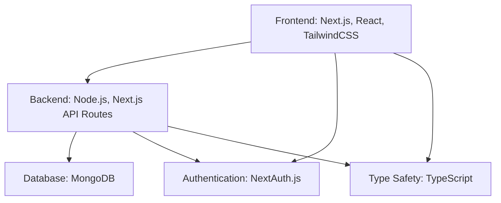

#  VaidyaCare - Smart Care Assistant

🩺 A modern healthcare platform designed to help doctors manage patient data efficiently and detect potential health issues early.

<div align="center">

[](https://www.typescriptlang.org/)
[](https://nextjs.org/)
[](https://www.mongodb.com/)
[](https://tailwindcss.com/)

</div>


## 🌟 Project Overview 

VaidyaCare is a web application that empowers healthcare providers with intelligent tools to deliver better patient care: 

### 👨‍⚕️ For Doctors
- 🔒 Secure dashboard to manage patient information
- 📅 Smart appointment scheduling with priority-based queueing
- ⚠️ Early detection of adverse drug reactions (ADRs)
- 📝 Patient history and medical records tracking
- 📊 Auto-generated reports and handoff sheets

### 🧑‍⚕️ For Patients
- 🗓️ Easy appointment booking with symptom tracking
- 💊 Medication management and reminders
- 📈 Visual representation of symptom trends over time
- 📋 Medical history documentation

## 🎯 Solution Objectives

VaidyaCare addresses critical healthcare challenges:

1. **Reduce Medical Errors** - Intelligent symptom tracking and ADR detection
2. **Optimize Physician Time** - Priority-based scheduling and automated documentation
3. **Improve Patient Outcomes** - Early detection and preventive care recommendations
4. **Enhance Healthcare Access** - Streamlined appointment system and digital health records
5. **Data-Driven Decisions** - Analytics and visualizations for better clinical insights

## 💎 Key Features

<table>
  <tr>
    <td>
      <h3>🩺 Smart Symptom Tracking</h3>
      Record structured symptom data with severity, duration, and relevant information
    </td>
    <td>
      <h3>⚠️ ADR Detection System</h3>
      Automatically flag potential adverse drug reactions
    </td>
  </tr>
  <tr>
    <td>
      <h3>🚨 Priority-Based Appointments</h3>
      Intelligent algorithm to assign emergency ratings (0-10)
    </td>
    <td>
      <h3>⏱️ Estimated Appointment Duration</h3>
      Calculate consultation time based on symptoms
    </td>
  </tr>
  <tr>
    <td>
      <h3>🔮 Early Warning System</h3>
      Predict potential conditions based on reported symptoms
    </td>
    <td>
      <h3>📊 Health Analytics</h3>
      Visualize patient health trends over time
    </td>
  </tr>
</table>

## 🔧 Technology Stack



- **Frontend**: Next.js, React, TailwindCSS
- **Backend**: Node.js, Next.js API Routes
- **Database**: MongoDB
- **Authentication**: NextAuth.js
- **Type Safety**: TypeScript

## 🚀 Getting Started

### Prerequisites
- Node.js 16+ 
- npm or yarn
- MongoDB instance (local or Atlas)

### Installation

1. Clone the repository
```bash
git clone https://github.com/yourusername/vaidya-care.git
cd vaidya-care
```

2. Install dependencies
```bash
npm install
```

3. Create a `.env.local` file in the root directory with the following variables:
```
MONGODB_URI=your_mongodb_connection_string
NEXTAUTH_SECRET=your_nextauth_secret
NEXTAUTH_URL=http://localhost:3000
```

4. Start the development server
```bash
npm run dev
```

5. Open [http://localhost:3000](http://localhost:3000) in your browser to see the application

## 📁 Project Structure

```
vaidya-care/
├── app/                  # Next.js app directory
│   ├── (auth)/           # Authentication pages (login, register)
│   ├── (dashboard)/      # Dashboard pages
│   ├── api/              # API routes
│   └── page.tsx          # Landing page
├── components/           # Reusable UI components
├── lib/                  # Utility functions and libraries
│   ├── adrDetection.ts   # Adverse Drug Reaction detection
│   ├── earlyDetection.ts # Early symptom detection and analysis
│   └── mongodb.ts        # MongoDB connection utility
├── models/               # MongoDB schema models
├── public/               # Static assets
└── tailwind.config.js    # TailwindCSS configuration
```

## 🧠 Intelligent Features Explained

### ADR Detection

 The system uses a predefined medication database to:
- Detect potential drug-drug interactions
- Identify symptoms that may be related to adverse drug reactions
- Flag dangerous medication combinations

### Symptom Analysis

 For each symptom collected, the system:
- Evaluates severity based on patient input
- Considers duration and intensity
- Cross-references with existing conditions
- Suggests possible diagnoses for the physician to consider

### Emergency Rating

 Appointments are automatically assigned a priority score (0-10) based on:
- Symptom severity
- Known high-risk combinations
- Patient history and risk factors
- Duration of symptoms

## 🔮 Future Enhancements

- Integration with wearable health devices
- Machine learning for improved symptom analysis
- Voice-to-text for easier data entry
- Mobile application development
- Integration with hospital EHR systems
- Telemedicine features

## 📜 License

This project is licensed under the MIT License - see the LICENSE file for details.

---

<div align="center">
  <p><i>Made with ❤️ for healthcare professionals and patients</i></p>
</div>
